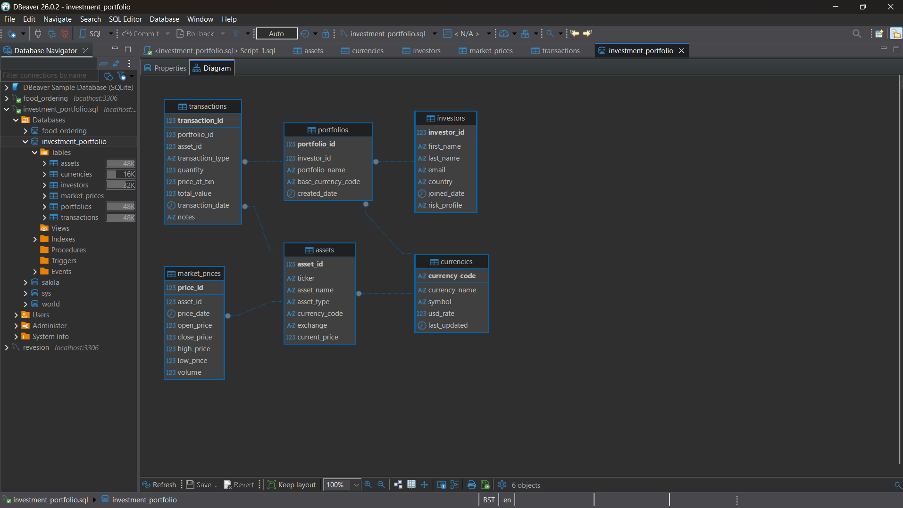

# Investment Portfolio Management System

## Overview

This project is a MySQL database designed to simulate an investment portfolio management system.

## Scenario

This system is designed for a financial platform that helps investors manage their portfolios and track their investments.

It allows users to:

* Store investor profiles and risk preferences
* Manage multiple portfolios in different currencies
* Track financial assets such as stocks, crypto, bonds, and forex
* Record buy and sell transactions
* Monitor market prices and asset performance

The system can be used to analyse trading activity, evaluate portfolio performance, and support investment decision-making.

## Features

* Normalised database structure
* Primary and foreign key relationships
* Mock data for testing
* Complex SQL queries using joins and aggregation
* Subqueries for advanced data retrieval
* Data update and delete operations
* Stored procedure for portfolio risk analysis

## Entity Relationship Diagram (ERD)

Below is the database schema diagram showing table relationships:

## Technologies Used

* MySQL
* SQL

## How to Run

1. Open the SQL file in MySQL Workbench or any SQL editor
2. Run the script to create the database and tables
3. Execute the queries to explore the data

This project was created as part of the CFG Data & MySQL Assignment.

## Author
Emine Ceran

# SQL-Assignment---Investment-Portfolio-Management-System
